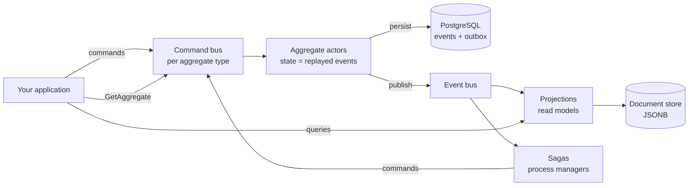

# ReactiveCQRS Documentation

**ReactiveCQRS** is a Scala library for CQRS + Event Sourcing on Apache Pekko actors with
PostgreSQL as the durable store. Aggregates are plain immutable case classes; commands
produce events; events are the source of truth; projections build read models; sagas
coordinate multi-step processes with compensation.

| Doc | What's inside |
|---|---|
| [getting-started.md](getting-started.md) | Dependencies, DB pool setup, full wiring, first command |
| [api.md](api.md) | The `api` module: `AggregateContext`, commands, events, results, responses, ids — with class diagram |
| [core.md](core.md) | The `core` module: actor pipeline, event store, event bus, projections, sagas, replay — with sequence/flow diagrams |
| [configuration.md](configuration.md) | Every constructor knob and default; DB tables created; test variants |
| [examples.md](examples.md) | Shopping-cart walkthrough: aggregate, handlers, projections, saga, undo/duplication/rewrite |

## The big picture

## Five things to know before writing code

1. **Initialize the ScalikeJDBC singleton pool before any framework code** — everything
   uses `DB.autoCommit`/`DB.localTx` on the default pool.
2. **Optimistic concurrency**: `Command` carries `expectedVersion` and fails on mismatch;
   `ConcurrentCommand` auto-retries. Responses are values, not exceptions — match the
   whole `CustomCommandResponse` family.
3. **No snapshots**: an aggregate's state is rebuilt by replaying all its events (limit
   10 000 by default). Design aggregates with bounded lifetimes.
4. **At-least-once delivery** to projections and sagas — make listeners idempotent (the
   framework helps: projection cursor updates share the listener's transaction, and saga
   commands are deduplicated via `SagaStep` idempotency keys).
5. **Event classes are your storage schema**: events persist as JSON; changing an event
   class requires an `eventsVersions` mapping or replay breaks.

Versions: Scala 2.13, Pekko 1.4.x, ScalikeJDBC 3.5.x, PostgreSQL (JDBC 42.x), mpjsons.
The `testdomain` module is the canonical, runnable example.
