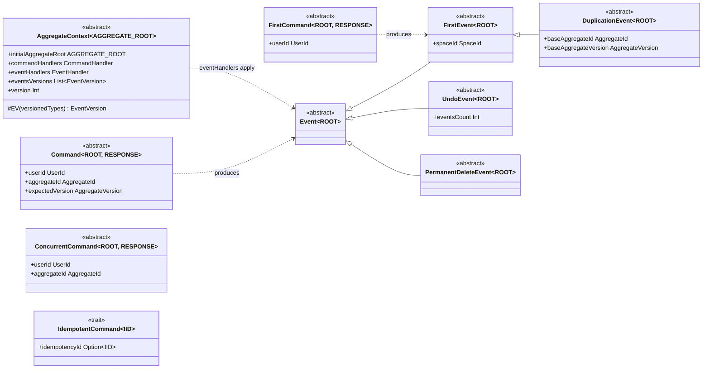

# API Reference (`api` module)

Everything a domain author touches lives in `io.reactivecqrs.api` (plus `.id` and `.command`).
The `api` module depends only on Pekko — your domain code never imports `core`.

## Overview



---

## AggregateContext

One `AggregateContext[AGGREGATE_ROOT]` per aggregate type — the single unit you implement:

```scala
abstract class AggregateContext[AGGREGATE_ROOT : ClassTag] {
  def initialAggregateRoot: AGGREGATE_ROOT

  type CommandHandler = AGGREGATE_ROOT => PartialFunction[Any, GenericCommandResult[Any]]
  type EventHandler   = (UserId, Instant, AGGREGATE_ROOT) => PartialFunction[Any, AGGREGATE_ROOT]

  def commandHandlers: CommandHandler   // current state => command => result (events)
  def eventHandlers: EventHandler       // (user, time, state) => event => new state

  val eventsVersions: List[EventVersion[AGGREGATE_ROOT]] = List.empty  // schema versioning
  val version: Int                      // aggregate context version (abstract)
}
```

- `commandHandlers` is curried over current state; it pattern-matches on the command and returns a `GenericCommandResult` (usually `CommandSuccess(events)` or `CommandFailure`).
- `eventHandlers` receives `(UserId, Instant, currentRoot)` and pattern-matches on the event, returning the new aggregate root. Must be pure — it runs on every replay.
- `rewriteHistoryCommandHandlers` — optional, only needed if you use `RewriteHistoryCommand`s; the default throws.
- The aggregate root itself is a plain immutable case class. The framework holds it as `Option[AGGREGATE_ROOT]` — `None` means deleted.

### Event schema versioning (`EV`)

When an event class shape changes, keep old JSON replayable by mapping version numbers to classes:

```scala
override val eventsVersions = List(
  EV[ItemAdded]((1, classOf[ItemAddedV1]), (2, classOf[ItemAdded]))  // (versionInt, class)
)
```

Events persist keyed by `event_type_id` + `event_type_version`; without a mapping, replay of old events fails at deserialization.

### Async handlers

A handler may return `Future[CustomCommandResult[T]]` — the protected implicit `future2AsyncResult` wraps it into `AsyncCommandResult` automatically.

---

## Commands

Five independent abstract classes (no common supertype — the command bus routes by which one you extend). All take `[AGGREGATE_ROOT, RESPONSE <: CustomCommandResponse[_]]`:

| Command | Fields | Semantics |
|---|---|---|
| `FirstCommand` | `userId` | Creates a new aggregate; the bus allocates the `AggregateId`. Must result in a `FirstEvent`. |
| `Command` | `userId`, `aggregateId`, `expectedVersion` | Strict optimistic lock: fails with `AggregateConcurrentModificationError` if current version ≠ `expectedVersion`. |
| `ConcurrentCommand` | `userId`, `aggregateId` | Uses the current version; **auto-retries** on concurrent modification. |
| `RewriteHistoryCommand` | + `expectedVersion`, `eventsTypes: Set[Class[_]]` | Rewrites past events of the given types (strict version check). |
| `RewriteHistoryConcurrentCommand` | `eventsTypes` | Rewrite variant with auto-retry. |

### Idempotency

```scala
trait IdempotentCommand[IID <: CommandIdempotencyId] { val idempotencyId: Option[IID] }
case class SagaStep(sagaId: SagaId, step: Int) extends CommandIdempotencyId  // canonical key
```

Mix `IdempotentCommand` into any command flavor. With `Some(id)`, a repeated command returns the cached prior response instead of re-executing (stored in `commands_responses`).

---

## Command results (what handlers return)

```scala
sealed abstract class GenericCommandResult[+RESPONSE_INFO]
sealed abstract class CustomCommandResult[+RESPONSE_INFO] extends GenericCommandResult[RESPONSE_INFO]

case class CommandSuccess[ROOT, INFO](events: Seq[Event[ROOT]], responseInfo: INFO) extends CustomCommandResult[INFO]
case class CommandFailure[ROOT, INFO](response: FailureResponse) extends CustomCommandResult[INFO]
case class RewriteCommandSuccess[ROOT, INFO](eventsRewritten: Iterable[EventWithVersion[ROOT]],
                                             events: Seq[Event[ROOT]], responseInfo: INFO) extends CustomCommandResult[INFO]
case class AsyncCommandResult[INFO](future: Future[CustomCommandResult[INFO]]) extends GenericCommandResult[INFO]
```

Convenience constructors: `CommandSuccess(event)`, `CommandSuccess(events)`, `CommandFailure("message")`, `CustomCommandFailure[ROOT, INFO]("message")`.

Type aliases (package object): `CommandResult = GenericCommandResult[Nothing]`, `CommandResponse = CustomCommandResponse[Nothing]` — where `Nothing` is the framework's own empty-payload case class (`Nothing.empty`), not Scala's bottom type.

---

## Command responses (what the caller receives)

The framework persists the events, then replies with one of (sealed under `CustomCommandResponse[INFO]`):

| Response | Meaning |
|---|---|
| `SuccessResponse(aggregateId, aggregateVersion)` | Standard success. The id matters after `FirstCommand`; the version feeds the next `Command.expectedVersion`. |
| `CustomSuccessResponse(aggregateId, aggregateVersion, info)` | Success + your handler's `responseInfo`. |
| `FailureResponse(exceptions: List[String])` | Domain-level failure from `CommandFailure`. |
| `AggregateConcurrentModificationError(id, type, expected, was)` | Optimistic-lock violation. |
| `CommandHandlingError(commandName, errorId, commandId)` | Exception inside your command handler (`errorId` correlates with logs). |
| `EventHandlingError(eventName, errorId, commandId)` | Exception applying a produced event. |

Callers should pattern-match the full family — declared `RESPONSE` is only the success shape.

---

## Events

```scala
abstract class Event[AGGREGATE_ROOT: TypeTag] extends Serializable
abstract class FirstEvent[ROOT]           extends Event[ROOT] { def spaceId: SpaceId }
abstract class UndoEvent[ROOT]            extends Event[ROOT] { val eventsCount: Int }
abstract class DuplicationEvent[ROOT]     extends FirstEvent[ROOT] {
  val baseAggregateId: AggregateId; val baseAggregateVersion: AggregateVersion }
abstract class PermanentDeleteEvent[ROOT] extends Event[ROOT]
```

- **`FirstEvent`** — creates the aggregate; must supply a `SpaceId` (space = tenant/partition; stored on the `aggregates` row).
- **`UndoEvent(eventsCount)`** — logically cancels the last N events (they become no-ops during replay); still appended, version still increments.
- **`DuplicationEvent`** — new aggregate as a copy of another at a version; shares the base's history up to that version, then diverges.
- **`PermanentDeleteEvent`** — hard-deletes aggregate + events (vs. soft delete = event handler returning a "deleted" state / `None` root).

Events are stored as JSON (mpjsons) — keep them simple immutable case classes.

---

## Querying aggregate state

Ask-protocol messages answered by the framework (send to the command bus / repository — see [core.md](core.md)):

| Message | Returns |
|---|---|
| `GetAggregate(id)` | `Aggregate(id, version, aggregateRoot: Option[ROOT])` — current state |
| `GetAggregateMinVersion(id, version, maxMillis)` | Same, but waits up to `maxMillis` for the aggregate to reach `version` (read-your-writes) |
| `GetAggregateForVersion(id, version)` | State at an exact historical version |
| `GetAggregateAtInstant(id, instant)` | State at a point in time |
| `GetEventsForAggregate(id)` / `GetEventsForAggregateForVersion(id, v)` | The event stream |

---

## Ids and versions

| Type | Notes |
|---|---|
| `AggregateId(asLong: Long)` | Globally unique aggregate id (allocated from DB-sequence pools). |
| `AggregateVersion(asInt: Int)` | Starts at `ZERO`; +1 per event. Ops: `<`, `<=`, `>`, `>=`, `increment`, `isJustAfter`. |
| `UserId(asLong)` | Command originator; `UserId.fromAggregateId(id)` if users are aggregates. |
| `SpaceId(asLong)` | Tenant/partition id; `SpaceId(aggregateId)` to use an aggregate (e.g. an organization) as the space; `SpaceId.unknown` sentinel = `-1`. |
| `CommandId(asLong)` | Unique per command; appears in error responses. |
| `SagaId(asLong)` | Saga instance id; part of `SagaStep` idempotency keys. |

## Exceptions

- `NoEventsForAggregateException` — unknown aggregate id.
- `AggregateInIncorrectVersionException` — requested version not (yet) reached.
- `EventTooLargeException` — serialized event exceeds the configured max size.
- `TooManyEventsException` — aggregate hit the event-count ceiling (default 10 000; no snapshotting — see [core.md](core.md)).
