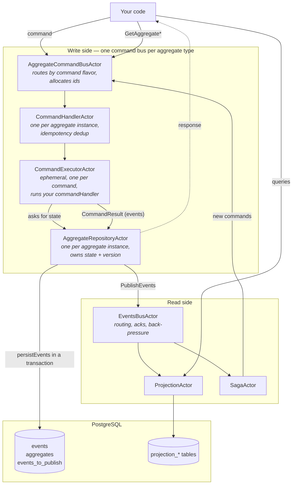
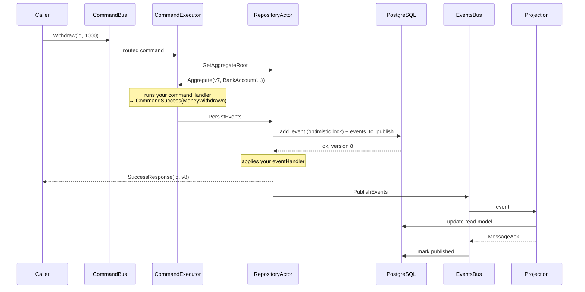

# Architecture

What actually happens when you send a command, and who owns what.

This page is about the shape of the system as an application developer experiences it. For an
internals map aimed at people modifying the framework, see `CLAUDE.md` in the repository root.

## The actors

Everything is Pekko actors. There is no container, no dependency injection and no
auto-configuration — you construct the actors yourself
([getting-started.md](getting-started.md#5-wire-the-system)).



## Write path, step by step

1. **`AggregateCommandBusActor`** — one per aggregate *type*. It inspects the command's flavor,
   allocates an `AggregateId` (for a `FirstCommand`) and a `CommandId` from pools handed out by
   the `UidGeneratorActor`, and routes to the right child. It caches child actor references and
   reaps idle ones.

2. **`CommandHandlerActor`** — one per aggregate *instance*. If the command is an
   `IdempotentCommand` with an `idempotencyId`, this is where a previously cached response is
   returned instead of executing again.

3. **`CommandExecutorActor`** — ephemeral, one per command. It asks the repository actor for
   current state, runs **your** `commandHandlers`, and gets back a `CommandResult`. If the
   handler returned an `AsyncCommandResult`, the executor waits on the future without blocking
   anyone. This actor is also where `ConcurrentCommand` retry happens: on
   `AggregateConcurrentModificationError` it re-fetches current state and runs your handler again
   against the fresh version.

4. **`AggregateRepositoryActor`** — one per aggregate instance, and the source of truth. It:
   - persists the events inside a single database transaction, where a PL/pgSQL stored procedure
     (`add_event`, `add_undo_event`, `add_duplication_event`) performs the optimistic-lock check;
   - applies **your** `eventHandlers` to update the in-memory root and version;
   - hands the events to the event bus for publication;
   - answers state queries (`GetAggregate`, `GetAggregateForVersion`, …).

   On first access it rebuilds state by replaying the aggregate's entire event stream. There are
   no snapshots.

The caller's response is sent once the events are durably persisted — not once projections have
seen them.



Everything below the `SuccessResponse` line happens after your caller has already been answered.
That gap is the eventual consistency window.

## Read paths

There are two, with different guarantees.

**Through the command bus** — strongly consistent, served by the actor that owns the aggregate:

```scala
accountsCommandBus ? GetAggregate(id)
accountsCommandBus ? GetAggregateForVersion(id, AggregateVersion(7))
accountsCommandBus ? GetAggregateAtInstant(id, instant)
accountsCommandBus ? GetAggregateMinVersion(id, AggregateVersion(8), maxMillis = 5000)
accountsCommandBus ? GetEventsForAggregate(id)
```

These answer with a `Try`, since asking for a nonexistent aggregate is a failure rather than an
empty result. `GetAggregateMinVersion` is the useful one for bridging consistency: the repository
actor holds the query until the aggregate reaches the requested version or the timeout expires.

**Through a projection** — eventually consistent, served from a document store. You define the
query messages yourself in `receiveQuery`.

## Event delivery

`EventsBusActor` sits between the write side and every subscriber. It is not a simple fan-out:

- Events are written to an **outbox** (`events_to_publish`) in the same transaction as the events
  themselves, so nothing is lost if the process dies before publication.
- The bus tracks in-flight messages per subscriber and waits for a `MessageAck` before marking an
  event published in the `event_bus` cursor table. A subscriber that never acks blocks progress
  for its own subscription.
- It applies **back-pressure**: a bounded in-flight buffer means a slow projection slows
  publication rather than accumulating unboundedly.
- Delivery is **at-least-once and can be out of order**. Projections handle ordering with internal
  delay buffers, and must be idempotent regardless.

At startup the bus waits for the number of subscribers you declared in
`EventBusSubscriptionsManager(n)` before publishing. Getting that number wrong is a common cause
of "my projection is empty".

## Where your code plugs in

| You write | The framework calls it |
|---|---|
| `AggregateContext.commandHandlers` | In `CommandExecutorActor`, once per command, with current state. |
| `AggregateContext.eventHandlers` | In `AggregateRepositoryActor`, once per event — on write **and** on every replay. |
| `AggregateContext.rewriteHistoryCommandHandlers` | For `RewriteHistoryCommand`s, with the selected past events. |
| `ProjectionActor.listeners` | In `ProjectionActor`, per delivered event or aggregate update, inside a DB session. |
| `ProjectionActor.receiveQuery` | On the projection actor's thread, for your query messages. |
| `SagaActor.handleOrder` / `handleRevert` | On a dispatcher thread, returning a `Future`. |

## Threading rules that matter to you

Actor state is `var`s and mutable collections, safe only because a single actor processes one
message at a time. Two rules follow, and both are easy to violate by accident:

- **Never touch actor state from inside a `Future` or `onComplete` callback.** Those run on a
  dispatcher thread, not the actor thread.
- **Never call `sender()` inside a `Future` or callback.** By the time it runs, `sender()` refers
  to whatever message the actor is handling now. Capture it into a `val` first.

Also: don't block inside an actor. If a command handler needs I/O, return an `AsyncCommandResult`
rather than `Await`ing — blocking the aggregate's repository actor blocks every write to that
aggregate.

## Scope and limits

- **Single-node assumption.** `PostgresDocumentStore` and `PostgresSubscriptionsState` keep
  in-memory caches with no cross-instance invalidation. Running several instances against one
  database can produce stale reads.
- **No snapshots.** Aggregate load time grows with stream length.
- **Postgres-specific.** The optimistic locking lives in PL/pgSQL stored procedures; the store is
  not pluggable today ([roadmap.md](roadmap.md)).

See [operations.md](operations.md) for the practical consequences.
