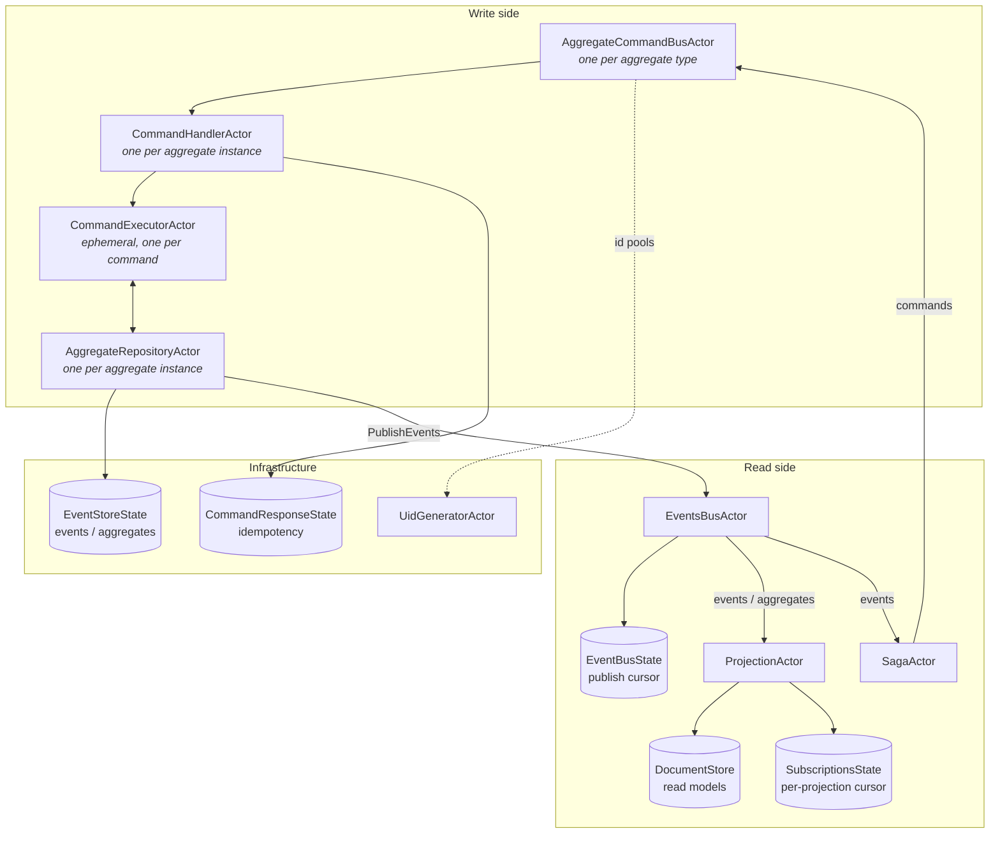
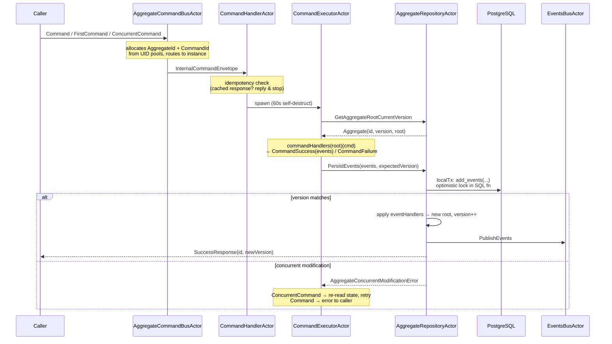
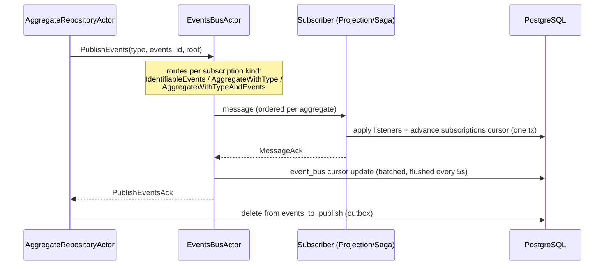
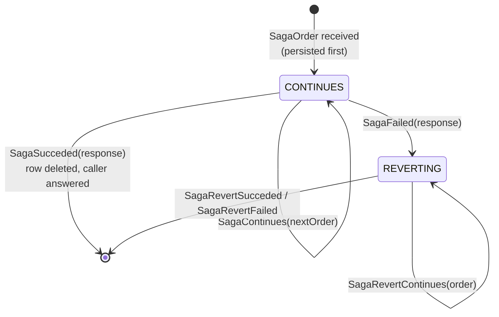

# Core Architecture (`core` module)

The `core` module (`io.reactivecqrs.core.*`) contains all the machinery: actors, event
store, event bus, projections, sagas, document store, and UID generation. You construct
and wire these; your domain code only implements the `api` contracts.

## Component overview



## Write path: command → events



Key facts:

- **No snapshots.** `AggregateRepositoryActor` rebuilds state by replaying the entire event
  stream on first access, then keeps it in memory. `aggregateVersionLimit` (default 10 000)
  caps events per aggregate — `TooManyEventsException` past it.
- **Optimistic locking** lives in PostgreSQL stored procedures (`add_event(s)`,
  `add_undo_event`, `add_duplication_event`): the version compare and insert are atomic.
- Idle per-instance actors are reaped by the command bus (`keepAliveLimit`, default 200,
  swept at most every 5 min; inactivity limit default 12 h).
- Historical reads (`GetAggregateForVersion` / `GetAggregateAtInstant`) spawn a temporary
  repository actor that replays up to that point and then dies.

## Event publication & delivery



- **Outbox pattern**: persisted events land in `events_to_publish`; the repository resends
  unacked events (10 s after restore, then every 180 s), and the command bus periodically
  runs `EnsureEventsPublished` (30 s once, then every 60 s) — so delivery is at-least-once.
- **Delivery is at-least-once → listeners must be idempotent.** Ordering per aggregate is
  guaranteed by version gap-detection; projections buffer out-of-order updates and merge.
- **Back-pressure**: `EventsBusActor(MAX_BUFFER_SIZE = 10000)` grants credits to producers
  (used heavily during replay via `BackPressureActor`).
- `EventBusSubscriptionsManager(minimumExpectedSubscriptions)` holds delivery until that
  many subscriptions have registered — the count must match your projection/saga listener
  registrations, or the bus waits (up to 180 s).

## Projections

Extend `ProjectionActor` (or `SubscribableProjectionActor` for push updates to clients, or
`AggregateListenerActor` for listeners without a query side). You supply:

```scala
protected val projectionName: String
protected val version: Int                       // bump to trigger rebuild via replayer
protected val subscriptionsState: SubscriptionsState
protected val eventBusSubscriptionsManager: EventBusSubscriptionsManagerApi
protected val listeners: List[Listener[Any]]
protected def receiveQuery: Receive              // your query messages
protected def onClearProjectionData(): Unit      // wipe read model before rebuild
```

Three listener styles (each also has a `.noDBSession` variant that skips the transaction):

| Listener | Callback signature |
|---|---|
| `EventsListener[ROOT]` | `(AggregateId, Seq[EventInfo[ROOT]]) => DBSession => Unit` |
| `AggregateListener[ROOT]` | `(AggregateId, AggregateVersion, created: Boolean, Option[ROOT]) => DBSession => Unit` |
| `AggregateWithEventsListener[ROOT]` | `(AggregateId, AggregateVersion, Option[ROOT], Seq[EventInfo[ROOT]]) => DBSession => Unit` |

Listener writes and the subscription-cursor advance run in **one transaction**, so a
projection is exactly-once as long as the listener only touches the same DB.

Delayed queries: `delayIfNotAvailable(respondTo, search, forMaximumMillis)` (+ async and
custom variants) let a query wait briefly for an update that hasn't arrived yet —
read-your-writes for eventually consistent read models.

`SubscribableProjectionActor` adds live subscriptions: `handleSubscribe(subscriptionId,
listener, filter)` + `sendUpdate(data)`; subscriptions expire after `subscriptionTTL`
(default 10 min) unless renewed.

## Sagas (process managers)

`SagaActor` runs multi-step processes with compensation:

```scala
val name: String                 // saga table key
val state: SagaState             // PostgresSagaState
val uidGenerator: ActorRef

def handleOrder(step: SagaStep): PartialFunction[SagaInternalOrder, Future[SagaHandlingStatus]]
def handleRevert(step: SagaStep): PartialFunction[SagaInternalOrder, Future[SagaRevertHandlingStatus]]
```



- Every step is persisted **before** it executes; on restart `loadAllSagas` resumes
  pending sagas from the `sagas` table.
- Commands issued from steps should be `IdempotentCommand`s keyed by `SagaStep(sagaId, step)`
  so a resumed step can't double-execute.
- Note the spelling in code: `SagaSucceded` / `SagaRevertSucceded`.

## Event store & special events

`PostgresEventStoreState` persists events as JSON (mpjsons) in the `events` table.

- **Undo**: `UndoEvent(eventsCount)` marks the previous N events as no-ops (`noop_events`
  table); replay skips them. Version still increments.
- **Duplication**: `DuplicationEvent` creates a new aggregate whose history is the base
  aggregate's events up to `baseAggregateVersion` plus its own — implemented via
  `base_id`/`base_order`/`base_version` on the `aggregates` table (a "duplication chain").
- **Permanent delete**: `PermanentDeleteEvent` hard-deletes the aggregate's rows from
  `aggregates`, `noop_events`, `events`, `events_to_publish`, and `subscriptions` in one
  transaction.
- Event schema evolution: stored `(event_type_id, event_type_version)` is mapped back to a
  concrete class via `AggregateContext.eventsVersions`; unmapped events deserialize as the
  written class at version 0.

## Document store

`PostgresDocumentStore[T]("name", mpjsons, cache, indices)` stores read models as `JSONB`
in table `projection_<name>` (`space_id, id PK, version, document`), with optimistic
version checks (up to 10 retries) and optional JSON-path indices (unique/multiple
text/int/long, GIN array). Query API: `getDocument(s)`, `findDocumentByPath(s)`,
`findDocument(DocumentStoreQuery(where, sortBy, offset, limit))`, `updateDocument`,
`overwriteDocument`, `removeDocument`, `findAll`, `clearSpace`.
`PostgresDocumentStoreAutoId` adds sequence-generated keys. `MemoryDocumentStore` is the
test-only variant. Caching is pluggable via `DocumentStoreCache` (`NoopDocumentStoreCache`
to disable) — note caches are per-JVM with no cross-instance invalidation.

## UID generation

`AggregateId`/`CommandId`/`SagaId` come from **pools** backed by Postgres sequences
(`aggregates_uids_seq`, `commands_uids_seq`, `sagas_uids_seq`; `INCREMENT BY 100`, so pool
size = 100 per `NEXTVAL`). `UidGeneratorActor` serves pool requests; the command bus and
saga actor block (up to 60 s) when a pool drains — size sequences' `increment_by` for your
write rate.

## Replay / rebuilding projections

When a projection's `version` (or an aggregate context's `version`) changes,
`EventsReplayOrchestrator.replay(...)` compares versions in `components_versions`
(`PostgresVersionsState`), clears affected projections (`ClearProjectionData`), then has
`EventsReplayerActor` stream **all** events through per-aggregate replay actors back onto
the event bus (`PublishReplayedEvents`, with back-pressure), and finally records the new
versions. See `testdomain/.../EventsReplaySpec.scala` for wiring:

```scala
val replayer = system.actorOf(Props(new EventsReplayerActor(eventStoreState, eventBusActor,
  subscriptionsState, ReplayerConfig(), List(ReplayerRepositoryActorFactory(new ShoppingCartAggregateContext)))))
```

## Threading & operational cautions

- Persisting runs a synchronous DB transaction on the aggregate actor's thread — the
  per-aggregate write ceiling. Full-stream replay on first access makes long-lived
  aggregates slow to wake.
- Delivery is at-least-once; write idempotent projection listeners.
- Single-node assumption: in-memory caches (document store, subscriptions) have no
  cross-instance invalidation.
- See `CLAUDE.md` §7 for the maintained hotspot/risk catalog.
