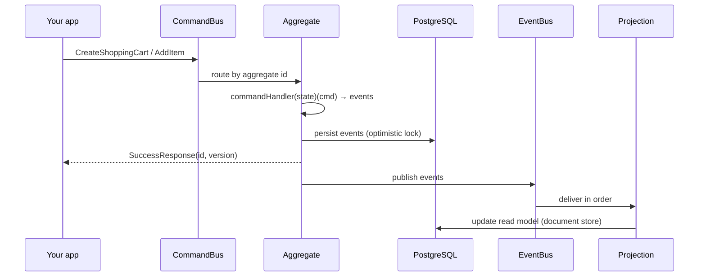

# Getting Started

ReactiveCQRS is a Scala library implementing **CQRS + Event Sourcing** on
[Apache Pekko](https://pekko.apache.org/) actors, with **PostgreSQL** as the durable store
(via ScalikeJDBC) and **mpjsons** for JSON serialization of events and documents.
It is a library, not a runnable app — your application wires it together.

## Requirements

- Scala **2.13**, JVM 1.8+
- A running **PostgreSQL** database (tables and stored procedures are auto-created by the framework)
- Pekko 1.4.x, ScalikeJDBC 3.5.x on your classpath (pulled in transitively)

## Dependencies

```scala
libraryDependencies ++= Seq(
  "io.reactivecqrs" %% "reactivecqrs-api"  % "0.12.46",  // domain API (commands, events, AggregateContext)
  "io.reactivecqrs" %% "reactivecqrs-core" % "0.12.46"   // actors, event store, event bus, projections, sagas
)
```

## 1. Initialize the connection pool (before anything else)

The framework uses the **default singleton ScalikeJDBC pool**. Initialize it before any
framework code runs:

```scala
import scalikejdbc._

Class.forName("org.postgresql.Driver")
ConnectionPool.singleton(
  "jdbc:postgresql://localhost:5432/reactivecqrs", "user", "password",
  ConnectionPoolSettings(initialSize = 5, maxSize = 20, connectionTimeoutMillis = 3000L))
```

## 2. Wire the system

Order matters: states (each with idempotent `initSchema()`), then UID generator, then
event bus, then command buses, then sagas/projections.

```scala
import org.apache.pekko.actor.{ActorSystem, Props}
import io.mpjsons.MPJsons
import io.reactivecqrs.core.commandhandler.{AggregateCommandBusActor, PostgresCommandResponseState}
import io.reactivecqrs.core.documentstore.{NoopDocumentStoreCache, PostgresDocumentStore}
import io.reactivecqrs.core.eventbus._
import io.reactivecqrs.core.eventstore.PostgresEventStoreState
import io.reactivecqrs.core.projection.PostgresSubscriptionsState
import io.reactivecqrs.core.saga.PostgresSagaState
import io.reactivecqrs.core.types.PostgresTypesNamesState
import io.reactivecqrs.core.uid.{PostgresUidGenerator, UidGeneratorActor}

val system  = ActorSystem("main-actor-system")
val mpjsons = new MPJsons

// Durable states — initSchema() creates tables/sequences/stored procs (idempotent)
val typesNamesState      = new PostgresTypesNamesState().initSchema()
val eventStoreState      = new PostgresEventStoreState(mpjsons, typesNamesState).initSchema()
val commandResponseState = new PostgresCommandResponseState(mpjsons, typesNamesState).initSchema()
val eventBusState        = new PostgresEventBusState().initSchema()

// UID generator — pools of ids from Postgres sequences
val uidGenerator = system.actorOf(Props(new UidGeneratorActor(
  new PostgresUidGenerator("aggregates_uids_seq"),
  new PostgresUidGenerator("commands_uids_seq"),
  new PostgresUidGenerator("sagas_uids_seq"))), "uidGenerator")

// Event bus — the arg (2) is how many subscribers to wait for before starting delivery
val eventBusSubscriptionsManager =
  new EventBusSubscriptionsManagerApi(system.actorOf(Props(new EventBusSubscriptionsManager(2))))
val eventBusActor = system.actorOf(
  Props(new EventsBusActor(eventBusState, eventBusSubscriptionsManager)), "eventBus")

// One command bus per aggregate type
val shoppingCartCommandBus = system.actorOf(
  AggregateCommandBusActor(new ShoppingCartAggregateContext,
    uidGenerator, eventStoreState, commandResponseState, eventBusActor, false),
  "ShoppingCartCommandBus")

// Projections (read models)
val subscriptionsState = new PostgresSubscriptionsState(typesNamesState, true)
subscriptionsState.initSchema()
val store = new PostgresDocumentStore[String]("carts", mpjsons, new NoopDocumentStoreCache)
val cartsProjection = system.actorOf(Props(new ShoppingCartsListProjection(
  eventBusSubscriptionsManager, subscriptionsState, store)))

// Sagas (optional)
val sagaState = new PostgresSagaState(mpjsons, typesNamesState)
sagaState.initSchema()
val saga = system.actorOf(Props(new MultipleCartCreatorSaga(sagaState, uidGenerator, shoppingCartCommandBus)))
```

Memory-backed variants exist for tests without a DB: `MemoryEventStore`, `MemoryUidGenerator`,
`MemoryDocumentStore`, etc.

## 3. Send commands, read state

```scala
import org.apache.pekko.pattern.ask
import io.reactivecqrs.api._
import io.reactivecqrs.api.id.UserId

val userId = UserId(1L)

// Create an aggregate
val created = (commandBus ? CreateShoppingCart(None, userId, "books"))
  .mapTo[CustomCommandResponse[_]]
// => SuccessResponse(aggregateId, AggregateVersion(1))

// Modify it — expectedVersion is the optimistic lock
commandBus ? AddItem(userId, aggregateId, AggregateVersion(1), "apple")

// Read current state
val cart = (commandBus ? GetAggregate(aggregateId)).mapTo[Aggregate[ShoppingCart]]
// cart.aggregateRoot: Option[ShoppingCart]  (None = deleted)
```

Match the full response family — failures arrive as values, not exceptions:
`SuccessResponse | CustomSuccessResponse | FailureResponse | AggregateConcurrentModificationError | CommandHandlingError | EventHandlingError`.

## Minimal flow



## Next steps

- [api.md](api.md) — commands, events, results, `AggregateContext` in detail
- [examples.md](examples.md) — full shopping-cart walkthrough (aggregate, projection, saga)
- [core.md](core.md) — architecture: actors, event store, event bus, delivery guarantees
- [configuration.md](configuration.md) — every knob and default, DB schema
