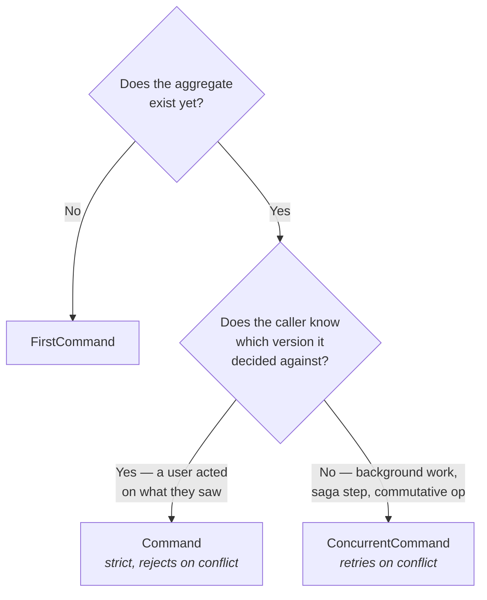

# Guide: commands

Commands are requests that may be refused. This guide covers the flavors, what each one does about
concurrency, how failures surface, asynchronous handlers, and idempotency.

## Choosing a flavor

The base class you extend determines routing and concurrency behaviour. This is the decision that
matters most.



### `FirstCommand` — create

```scala
case class OpenAccount(idempotencyId: Option[SagaStep], userId: UserId, owner: String, initialBalance: Long)
  extends FirstCommand[BankAccount, CustomCommandResponse[_]] with IdempotentCommand[SagaStep]
```

No `aggregateId` — the command bus allocates one and returns it:

```scala
val response = (bus ? OpenAccount(None, userId, "Alice", 10000L)).mapTo[CustomCommandResponse[_]]
// SuccessResponse(aggregateId, aggregateVersion)
```

The handler's `account` parameter is `initialAggregateRoot`, not real state. Ignore it.

### `Command` — strict optimistic lock

```scala
case class RenameOwner(userId: UserId, aggregateId: AggregateId, expectedVersion: AggregateVersion, owner: String)
  extends Command[BankAccount, CustomCommandResponse[_]]
```

The caller asserts which version it based its decision on. If the aggregate has moved on, you get
back `AggregateConcurrentModificationError(aggregateId, aggregateType, expected, was)` and
**nothing is persisted**.

Use this when a human or an external system acted on a specific state they had seen. The rejection
is the point — it tells the caller their view was stale.

```scala
val current = Await.result((bus ? GetAggregate(id)).mapTo[Try[Aggregate[BankAccount]]], 30.seconds).get
bus ? RenameOwner(userId, id, current.version, "Alice Smith")
```

### `ConcurrentCommand` — automatic retry

```scala
case class Deposit(idempotencyId: Option[SagaStep], userId: UserId, aggregateId: AggregateId, amount: Long)
  extends ConcurrentCommand[BankAccount, CustomCommandResponse[_]] with IdempotentCommand[SagaStep]
```

No expected version. The command runs against whatever the current version is, and on a
concurrent-modification conflict the framework re-fetches state and **runs your handler again**
against the fresh version.

This is subtle and important: the retry re-executes your decision logic, it does not blindly
re-apply the events. So a `Withdraw` that failed the balance check on the fresh state will
correctly fail, and one that passes will use the up-to-date balance. Because the handler re-runs,
it must be a pure function of `(state, command)` — which it should be anyway.

Use it for commutative operations, background jobs, and everything a saga issues (a saga has no
sensible expected version to supply).

### `RewriteHistoryCommand` — change the past

```scala
case class AnonymiseOwner(userId: UserId, aggregateId: AggregateId, expectedVersion: AggregateVersion,
                          replacement: String)
  extends RewriteHistoryCommand[BankAccount, CustomCommandResponse[_]] {
  override def eventsTypes: Set[Class[_]] = Set(classOf[AccountOpened], classOf[OwnerRenamed])
}
```

`eventsTypes` selects which past events are loaded and handed to your
`rewriteHistoryCommandHandlers`, which returns replacements for them plus a new event recording
that the rewrite happened:

```scala
def anonymiseOwner(command: AnonymiseOwner, events: Iterable[EventWithVersion[BankAccount]]): CommandResult = {
  val rewritten = events.map { ev =>
    ev.event match {
      case e: AccountOpened => EventWithVersion(ev.version, e.copy(owner = command.replacement))
      case e: OwnerRenamed  => EventWithVersion(ev.version, e.copy(owner = command.replacement))
      case _                => ev
    }
  }
  RewriteCommandSuccess(rewritten.toSeq, OwnerRenamed(command.replacement))
}
```

This destroys the original record. It exists for anonymisation and erasure obligations, not for
fixing bugs — for that, emit a compensating event. Note that projections built from the old events
are now inconsistent with history and should be rebuilt
([06-replay.md](06-replay.md)). `RewriteHistoryConcurrentCommand` is the retrying variant.

## Responses

Every response is a `CustomCommandResponse[_]`. Match on it; nothing throws.

| Response | Meaning |
|---|---|
| `SuccessResponse(aggregateId, aggregateVersion)` | Persisted. The version is the one *after* the events. |
| `CustomSuccessResponse(aggregateId, aggregateVersion, info)` | Same, with a value your handler returned. |
| `FailureResponse(exceptions)` | Your handler returned `CommandFailure`. A domain rejection. |
| `AggregateConcurrentModificationError(id, type, expected, was)` | A strict `Command`'s version did not match. |
| `CommandHandlingError(commandName, errorId, commandId)` | Your command handler threw. `errorId` correlates to the log. |
| `EventHandlingError(eventName, errorId, commandId)` | Your event handler threw — a bug, since event handlers must be total. |

```scala
(bus ? Withdraw(None, userId, id, 999999L)).mapTo[CustomCommandResponse[_]].map {
  case SuccessResponse(id, version)         => // ...
  case FailureResponse(reasons)             => // domain rejection, show the user
  case e: AggregateConcurrentModificationError => // re-read and retry
  case e: CommandHandlingError              => // a bug; look up e.errorId in the logs
}
```

### Returning a value from a handler

`CommandSuccess` takes an optional second argument:

```scala
CommandSuccess(MoneyWithdrawn(command.amount), account.balance - command.amount)
```

which the caller receives as `CustomSuccessResponse(id, version, info)`.

## Asynchronous handlers

A command handler must not block. The aggregate's repository actor serialises all writes to that
aggregate; blocking in a handler blocks every other write to it.

Return a `Future` instead. `AggregateContext` defines an implicit conversion from
`Future[CustomCommandResult[T]]` to `AsyncCommandResult[T]`, so returning the future from a
handler wired inside the context is enough:

```scala
def openAccount(command: OpenAccount) = Future {
  if (command.owner.trim.isEmpty) CommandFailure("Owner must not be blank")
  else                            CommandSuccess(AccountOpened(command.owner.trim, command.initialBalance))
}
```

Or construct it explicitly:

```scala
AsyncCommandResult(Future { /* ... */ })
```

The framework waits on the future off the actor thread and persists when it completes.

Two cautions:

- The future runs on **your** execution context — the framework does not inject one today
  ([roadmap.md](../roadmap.md)). Supply a context appropriate for what the work does; do not run
  blocking JDBC calls on the default global pool.
- The future body runs on a dispatcher thread, so it must not touch actor state, and must not
  call `sender()`.

## Idempotency

Mix in `IdempotentCommand[IID]` and supply an `idempotencyId`:

```scala
case class Deposit(idempotencyId: Option[SagaStep], userId: UserId, aggregateId: AggregateId, amount: Long)
  extends ConcurrentCommand[BankAccount, CustomCommandResponse[_]] with IdempotentCommand[SagaStep]
```

When the id is `Some(...)`, `CommandHandlerActor` stores the response in `commands_responses`
keyed by `idempotencyId.asDbKey`. A later command with the same key returns the **stored response**
without executing the handler again.

`SagaStep(sagaId, step)` is the built-in key and the reason sagas are safe to resume: a step
re-issued after a crash returns the original response instead of moving money twice. See
[05-sagas.md](05-sagas.md).

For your own keys, implement `CommandIdempotencyId`:

```scala
case class RequestId(value: String) extends CommandIdempotencyId {
  override def asDbKey: String = value
}
```

Two caveats:

- Passing `None` disables deduplication entirely. That is the right choice for user-initiated
  commands where each click really is a new request.
- The check is read-then-act rather than atomic, so two *simultaneous* identical commands can both
  miss the cache. In practice the optimistic version check usually rejects the second, but do not
  rely on idempotency as a concurrency-control mechanism — it is a crash-recovery mechanism.

## Sending commands

Commands are plain messages to the aggregate type's command bus:

```scala
implicit val timeout: Timeout = Timeout(30.seconds)
val response: Future[CustomCommandResponse[_]] =
  (accountsCommandBus ? OpenAccount(None, userId, "Alice", 10000L)).mapTo[CustomCommandResponse[_]]
```

Prefer composing the `Future`. If you must have a value synchronously — in a test, or at the edge
of a blocking API — `Await` it there, never inside an actor.

Fire-and-forget with `!` works too, but you lose the response, including failures. Use it only
when you genuinely do not care whether the command succeeded.

## Next

- [03-events.md](03-events.md) — event kinds and schema evolution
- [05-sagas.md](05-sagas.md) — commands across several aggregates
