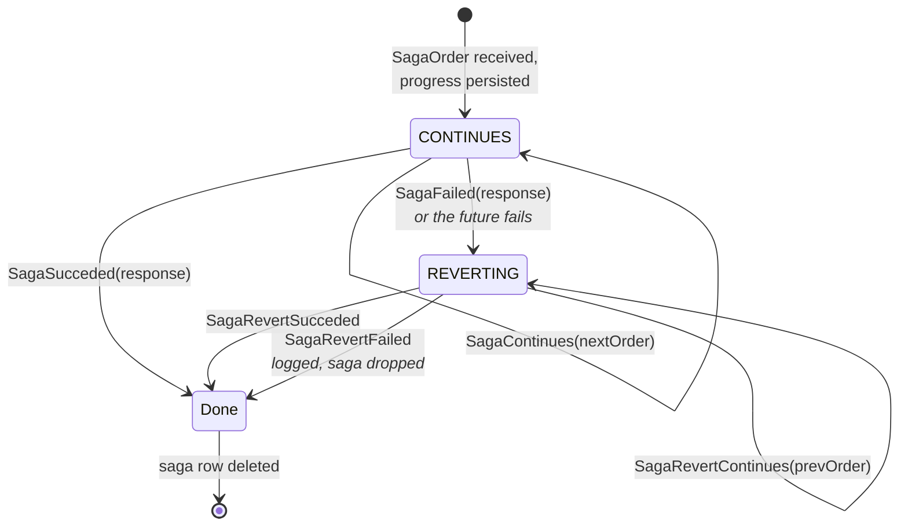

# Guide: sagas

A saga (process manager) coordinates a change spanning several aggregates. There are no
distributed transactions here — each step is its own local transaction, and failure is handled by
**compensating**: issuing new commands that undo earlier steps.

The worked example is
[`MoneyTransferSaga.scala`](../../examples/src/main/scala/io/reactivecqrs/example/bank/MoneyTransferSaga.scala):
move money from one account to another, refunding the source if the credit fails.

## The lifecycle



Step by step:

1. A `SagaOrder` arrives. Progress is written to the `sagas` table **before** the step runs.
2. `handleOrder(sagaStep)` returns a `Future[SagaHandlingStatus]`:
   - `SagaContinues(nextOrder)` — persist the next internal order, keep going.
   - `SagaSucceded(response)` — reply to the original sender, delete the saga row.
   - `SagaFailed(response)` — reply, then re-enter with the **same order** in phase `REVERTING`.
3. In `REVERTING`, `handleRevert(sagaStep)` is called with the order that failed, and walks
   backwards via `SagaRevertContinues` until `SagaRevertSucceded`.

Because progress is persisted at every step, a crash mid-process is resumed on restart — the saga
actor loads pending sagas in `preStart`.

## Orders

```scala
object MoneyTransferSaga {
  // Public entry point
  case class TransferMoney(userId: UserId, from: AggregateId, to: AggregateId, amount: Long) extends SagaOrder

  // Internal steps — persisted and resumed, but not part of the API
  private case class CreditTarget(userId: UserId, from: AggregateId, to: AggregateId, amount: Long)
    extends SagaInternalOrder

  sealed trait MoneyTransferResponse extends SagaResponse
  case class MoneyTransferred(from: AggregateId, to: AggregateId, amount: Long) extends MoneyTransferResponse
  case class MoneyTransferFailed(reasons: List[String]) extends MoneyTransferResponse
}
```

`SagaOrder` starts a saga; `SagaInternalOrder` is a subsequent step. Both are **serialised to the
`sagas` table**, so they are subject to the same schema-evolution caution as events: renaming an
internal order class can break in-flight sagas on the next deployment. Keep them simple, and carry
everything a resumed step needs — a resumed saga has no memory beyond its persisted order.

## Implementing

```scala
class MoneyTransferSaga(val state: SagaState,
                        val uidGenerator: ActorRef,
                        accountsCommandBus: ActorRef) extends SagaActor {

  import context.dispatcher

  override val name = "MoneyTransferSaga"

  override def handleOrder(sagaStep: SagaStep): ReceiveOrder = {
    case order: TransferMoney => debitSource(sagaStep, order)
    case order: CreditTarget  => creditTarget(sagaStep, order)
  }

  override def handleRevert(sagaStep: SagaStep): ReceiveRevert = {
    case order: CreditTarget => refundSource(sagaStep, order)
  }
}
```

`name` identifies this saga's rows in the `sagas` table. Changing it orphans in-flight sagas.

### The steps

```scala
private def debitSource(sagaStep: SagaStep, order: TransferMoney): Future[SagaHandlingStatus] =
  (accountsCommandBus ? Withdraw(Some(sagaStep), order.userId, order.from, order.amount))
    .mapTo[CustomCommandResponse[_]]
    .map {
      case _: SuccessResponse =>
        SagaContinues(CreditTarget(order.userId, order.from, order.to, order.amount))
      case f: FailureResponse =>
        // Nothing happened yet, so there is nothing to compensate — report and stop.
        SagaSucceded(MoneyTransferFailed(f.exceptions))
    }

private def creditTarget(sagaStep: SagaStep, order: CreditTarget): Future[SagaHandlingStatus] =
  (accountsCommandBus ? Deposit(Some(sagaStep), order.userId, order.to, order.amount))
    .mapTo[CustomCommandResponse[_]]
    .map {
      case _: SuccessResponse => SagaSucceded(MoneyTransferred(order.from, order.to, order.amount))
      case f: FailureResponse => SagaFailed(MoneyTransferFailed(f.exceptions))   // → REVERTING
    }

/** Compensation for a failed credit: give the money back to the source account. */
private def refundSource(sagaStep: SagaStep, order: CreditTarget): Future[SagaRevertHandlingStatus] =
  (accountsCommandBus ? Deposit(Some(sagaStep), order.userId, order.from, order.amount))
    .mapTo[CustomCommandResponse[_]]
    .map {
      case _: SuccessResponse => SagaRevertSucceded
      case f: FailureResponse => SagaRevertFailed(f.exceptions)
    }
```

Note the asymmetry in the first step. If the *debit* fails, nothing has happened yet, so there is
nothing to compensate — the saga reports the failure with `SagaSucceded(MoneyTransferFailed(...))`.
"Succeeded" here means "the process completed"; the payload says the transfer did not happen.
Returning `SagaFailed` would send it into `REVERTING` to undo a debit that never occurred.

`handleRevert` matches on the order **that failed**, not on the previous one. `CreditTarget`
failing means the source was already debited, so the compensation for that step is the refund.

## Idempotency is not optional

Every command a saga issues carries `Some(sagaStep)` as its idempotency id:

```scala
Withdraw(Some(sagaStep), order.userId, order.from, order.amount)
```

`SagaStep(sagaId, step)` is stored as the key in `commands_responses`. If the process crashes
after the withdrawal is persisted but before the saga row is updated, the resumed step re-issues
the same `Withdraw` with the same key — and gets the **cached response** rather than moving the
money twice.

Drop the idempotency id and a crash at the wrong moment double-debits. This is the single most
important thing to get right in a saga.

It follows that the commands a saga issues should be `ConcurrentCommand`s: a saga has no sensible
`expectedVersion` to assert, and steps that lose a race should retry rather than fail the whole
process.

## Wiring

```scala
val sagaState = new PostgresSagaState(mpjsons, typesNamesState)
sagaState.initSchema()   // note: returns Unit, unlike the other initSchema() methods

val transferSaga = system.actorOf(
  Props(new MoneyTransferSaga(sagaState, uidGenerator, accountsCommandBus)), "MoneyTransferSaga")
```

The `uidGenerator` is the same actor the command buses use — sagas draw their ids from the
`sagas_uids_seq` pool.

## Using it

```scala
val result: MoneyTransferResponse =
  Await.result((transferSaga ? TransferMoney(userId, aliceId, bobId, 1000L)).mapTo[MoneyTransferResponse], 30.seconds)
```

The saga replies to whoever sent the original `SagaOrder`. Under the hood the reply address is
stored as an actor path, so it survives a restart — a saga resumed after a crash can still answer
the original caller if that actor still exists.

## When to reach for a saga

Use one when a change spans aggregates and can tolerate being eventually consistent:

- transferring value between two aggregates,
- creating several related aggregates as one logical operation,
- reacting to an event by commanding a different aggregate.

Do **not** use one to fake a transaction. If two things must change atomically, they belong in the
same aggregate. A saga guarantees that the process eventually completes or compensates, not that
intermediate states are invisible — during a transfer, there is a real moment when the money is in
neither account.

## Rough edges

Worth knowing before you rely on sagas in production:

- **A failed compensation is logged and dropped.** `SagaRevertFailed` deletes the saga row. If the
  refund itself fails, no further retry happens and the system is left inconsistent. Make
  compensating commands as close to infallible as you can — a deposit rather than something with
  preconditions.
- **Persistence failures are not retried.** If writing saga progress fails, the exception is
  raised on a dispatcher thread where supervision does not see it, and the step is silently lost.
- **The `sagas` table has no index.** Loading pending sagas at startup scans the table. Fine for
  hundreds; consider adding an index if you accumulate many long-running sagas.

These are recorded in more detail in section 7 of `CLAUDE.md`.

## Next

- [06-replay.md](06-replay.md) — rebuilding read models
- [../operations.md](../operations.md) — running this in production
