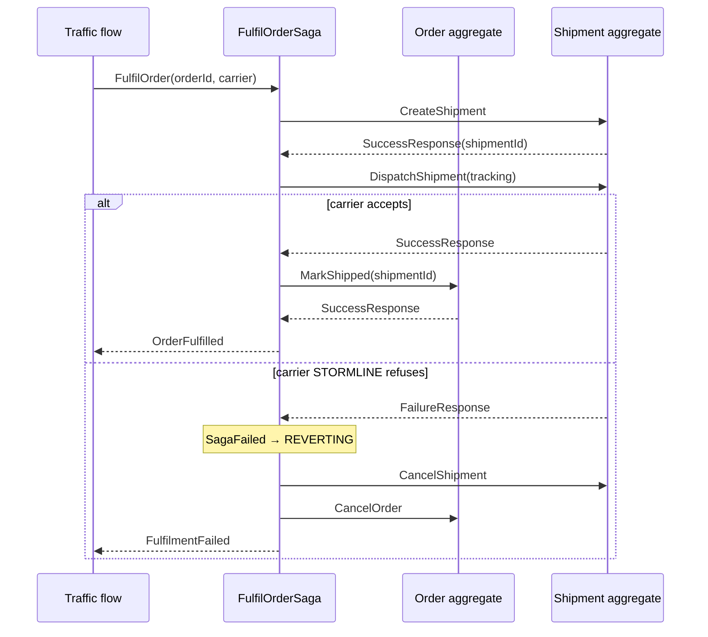

# Guide: the ordering + shipping sample app

A runnable application that exercises the whole framework: two aggregate types, a saga coordinating
them, three projections, and a CLI runner that generates randomised traffic and logs every stage of
processing.

Where the [bank example](../../examples/src/main/scala/io/reactivecqrs/example/bank) is a teaching
example — one concept per file, a scripted scenario — this one is shaped like an application:
concurrent traffic, failures that actually happen, compensation that actually runs.

Source: [`examples/.../fulfilment`](../../examples/src/main/scala/io/reactivecqrs/example/fulfilment).

## Running it

You need a PostgreSQL database ([getting-started.md](../getting-started.md#1-a-database)).

```bash
sbt "examples/runMain io.reactivecqrs.example.fulfilment.FulfilmentApp"
```

```bash
# 50 orders at 8/second, reproducible
sbt "examples/runMain io.reactivecqrs.example.fulfilment.FulfilmentApp --orders 50 --rate 8 --seed 42"

# heavier concurrency against the same aggregates
sbt "examples/runMain io.reactivecqrs.example.fulfilment.FulfilmentApp --orders 200 --rate 40 --concurrency 16"

# a different database
sbt "examples/runMain io.reactivecqrs.example.fulfilment.FulfilmentApp --jdbc-url jdbc:postgresql://localhost:5433/mydb --db-user me --db-password secret"
```

| Flag | Default | Meaning |
|---|---|---|
| `--orders N` | 20 | Number of order flows to generate |
| `--rate N` | 4 | Flows started per second |
| `--seed N` | 1 | RNG seed — the same seed produces the same run |
| `--concurrency N` | 8 | Threads generating traffic |
| `--report-every N` | 5 | Seconds between dashboard reports (0 disables) |
| `--jdbc-url`, `--db-user`, `--db-password` | local defaults | Database connection |
| `--help` | | Usage |

## The domain

Two aggregates, deliberately separate because they change for different reasons and belong to
different parts of the business — which means there is no transaction spanning them.

**`Order`** — placed, lines added and removed, paid, shipped, delivered, cancelled.
**`Shipment`** — created for an order, dispatched with a tracking code, delivered, cancelled.

Both use `String` status fields rather than sealed-trait ADTs. Aggregate roots travel through the
event bus and read models are serialized to JSON; ADTs are the shape most likely to surprise you
there. Nested case classes (`OrderLine`) are fine.

## What the saga does



The compensation path is the point. By the time dispatch fails, the shipment **already exists** —
there is nothing to roll back, so the saga issues new commands that semantically undo the earlier
step. See [05-sagas.md](05-sagas.md) for the mechanics.

### Why failures are deterministic

Dispatch fails for exactly one carrier, `STORMLINE` (`Carriers.Failing`). It is not a random draw
inside the command handler.

That is deliberate. A `ConcurrentCommand` handler **re-runs** on a concurrency conflict, so a
handler that consulted a random number generator would behave differently on retry and make the run
irreproducible. Making failure a function of aggregate state keeps `--seed` meaningful while still
exercising compensation — the *traffic generator* picks carriers randomly, so which orders fail is
seeded, but whether a given order fails is determined by its state.

The same reasoning applies to the payment limit: `PayOrder` rejects orders over 500 000 cents, and
the generator occasionally emits an expensive line so that path is reachable.

## What the traffic generator does

Each flow (`TrafficGenerator.runOrder`) derives its own `Random` from `seed` and the order index, so
flows are reproducible regardless of how they interleave across threads.

1. `PlaceOrder` — a `FirstCommand`; the bus allocates the id
2. 1–4 × `AddLine` — strict `Command`s, tracking the version each response returns
3. occasionally, an `AddLine` with a deliberately **stale** expected version
4. either `CancelOrder` (~20%) or `PayOrder`
5. on success, hand the order to the fulfilment saga with a random carrier
6. ~70% of fulfilled orders then get `DeliverShipment` + `MarkDelivered`

Step 3 exists to make the optimistic lock visible: you will see
`ConcurrentModification(aggregate=…, expected=1, was=5)` in the log, and nothing is persisted.

Flows block on `ask`, which is safe here only because they run on a dedicated thread pool, never on
an actor thread.

## Reading the log

Log categories are named for the pipeline stage, so the output reads as a column:

| Category | What it shows |
|---|---|
| `app` | Startup, run configuration, dashboard reports |
| `flow` | Per-order narrative — one flow's decisions end to end |
| `command` | Every command sent (`->`) and every response (`<-`) |
| `saga` | Each saga step, tagged `[sagaId/step]`, including `REVERT` |
| `projection.orders` / `projection.shipments` | Each read-model write |
| `projection.stats` | Event counters; `DEBUG` shows every individual event |

The shape of the output — this is illustrative, assembled from the log statements in the source
rather than captured from a run, since the environment these docs were written in had no database:

```
HH:mm:ss.SSS INFO  app                  system ready
HH:mm:ss.SSS INFO  flow                 === order flow #3 for globex ===
HH:mm:ss.SSS INFO  command              -> PlaceOrder(None,UserId(1),globex)
HH:mm:ss.SSS INFO  command              <- SuccessResponse(aggregate=7, version=1)
HH:mm:ss.SSS INFO  command              -> AddLine(UserId(1),Id(7),Version(1),GIZMO-9,3,4210)
HH:mm:ss.SSS INFO  command              <- SuccessResponse(aggregate=7, version=2)
HH:mm:ss.SSS INFO  projection.orders    order=7    v1   PLACED    lines=0 total=     0 globex
HH:mm:ss.SSS INFO  command              <- ConcurrentModification(aggregate=7, expected=1, was=2)
HH:mm:ss.SSS INFO  flow                 order flow #3 handing order=7 to the fulfilment saga via STORMLINE
HH:mm:ss.SSS INFO  saga                 [4/0] order=7 creating shipment via STORMLINE
HH:mm:ss.SSS INFO  saga                 [4/1] shipment=8 dispatch FAILED: Carrier STORMLINE refused ... -> compensating
HH:mm:ss.SSS INFO  saga                 [4/2] REVERT cancelling shipment=8 (dispatch failed)
HH:mm:ss.SSS INFO  saga                 [4/3] REVERT cancelling order=7 (dispatch failed)
HH:mm:ss.SSS INFO  saga                 [4/3] REVERT complete for order=7
```

Two things to watch for, because they are the framework's defining behaviours:

- **`projection.orders` lines lag behind `command` lines.** That is eventual consistency, visible
  directly. The command returned as soon as its events were persisted; the projection was updated
  afterwards.
- **The saga step counter increments across the revert.** Compensation is not a rollback; it is more
  forward steps, each one persisted to the `sagas` table before it runs.

### Turning up the detail

```xml
<!-- examples/src/main/resources/logback.xml -->
<logger name="io.reactivecqrs" level="DEBUG"/>   <!-- framework actor traffic -->
<logger name="projection.stats" level="DEBUG"/>  <!-- every event as processed -->
```

`io.reactivecqrs` at `DEBUG` logs every actor message. It is extremely verbose — useful once, when
you want to see `CommandExecutorActor` and `AggregateRepositoryActor` doing their work, and
unusable for a run of any size.

## The dashboard

Every `--report-every` seconds, and once at the end, the app queries all three projections:

```
==============================================================================
READ MODELS (final)
  orders    : 20 [DELIVERED=9 CANCELLED=6 SHIPPED=3 PLACED=2]
  shipments : 14 [DELIVERED=9 CANCELLED=3 DISPATCHED=2]
  events    : placed=20 paid=14 shipped=12 cancelled=6
              shipments created=14 dispatched=12 cancelled=3
==============================================================================
```

The final report is taken after a 3-second pause, because the flows finishing does not mean the
event bus has finished delivering. A production reader would use `GetAggregateMinVersion` or
subscribe rather than sleep — the sleep is a demo shortcut and is marked as such in the code.

## Things this sample demonstrates that the bank example does not

- **Two aggregate types** in one system, each with its own command bus.
- **A projection spanning both** — `FulfilmentStatsProjection` registers an `EventsListener` for
  `Order` *and* one for `Shipment`, which is how you build a read model no single aggregate could
  produce.
- **Real compensation**, triggered by a failure that genuinely occurs during a run.
- **Concurrent traffic** against the same aggregates, so the optimistic lock and the
  `ConcurrentCommand` retry path are exercised rather than described.
- **A zero-event `CommandSuccess`** used as an idempotent no-op. `MarkShipped` on an
  already-shipped order returns `CommandSuccess(Seq.empty)`, which the framework answers
  successfully without persisting anything
  (`CommandExecutorActor.scala:193`). This is what makes a resumed saga step safe even before the
  idempotency cache is consulted.

## Known simplifications

Called out rather than hidden, because copying them into production would be a mistake:

- **`FulfilmentStatsProjection` counters are not idempotent.** The event bus delivers at-least-once,
  so a redelivery double-counts. A real version would store the last processed version per aggregate
  in the document and skip anything at or below it.
- **`onClearProjectionData()` is empty** in all three projections. There is nothing to clear in a
  demo, but leaving it empty in a real projection makes a rebuild layer new data on top of old —
  the most common rebuild bug. See [06-replay.md](06-replay.md).
- **The run sleeps to wait for projections** instead of waiting on a version.
- **Failed compensation is only logged.** If `CancelOrder` fails during a revert, the framework
  drops the saga; the sample logs it at `ERROR` and does not retry. This is a framework limitation,
  noted in [05-sagas.md](05-sagas.md#rough-edges).

## Verification status

The code typechecks against the real Pekko, ScalikeJDBC and PostgreSQL jars (`scalac
-Ystop-after:typer`, Scala 2.13.18, the project's own `scalacOptions`). It has **not** been executed
— the environment these docs were written in had no PostgreSQL, no sbt, and no access to the
`mpjsons` artifact, which is not on Maven Central. Expect to fix small things on first run.

## Next

- [05-sagas.md](05-sagas.md) — the saga mechanics in detail
- [04-projections.md](04-projections.md) — projection styles and tuning
- [../operations.md](../operations.md) — what the sample creates in your database
